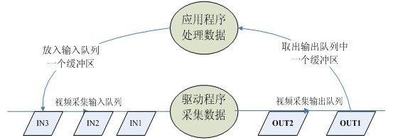

# V4L2 Capture

## 参考文档

* [使用v4l2编程操作摄像头设备获取图片](https://blog.csdn.net/aiwangtingyun/article/details/79834959)
* [使用V4L2编程获取摄像头设备信息](https://blog.csdn.net/aiwangtingyun/article/details/79834235)
* [yuyv图像转rgb后转bmp的一个简单demo](https://blog.csdn.net/dancer__sky/article/details/76724292)
* https://gist.github.com/piec/8791163
* [v4l2的学习建议和流程解析](https://www.cnblogs.com/silence-hust/p/4464291.html)

## 简要说明

* 源代码：[sample](sample)
* [Android.mk](sample/Android.mk)
* [Makefile](sample/Makefile)

## V4L2摄像头获取照片工作原理

* 打开视频设备文件：`int fd=open("/dev/video0",O_RDWR)`
* 查询视频设备的能力，比如是否具有视频输入,或者音频输入输出等：`ioctl(fd_v4l, VIDIOC_QUERYCAP, &cap)`
* 设置视频采集的参数
  * 设置视频的制式，制式包括PAL/NTSC，使用：`ioctl(fd_v4l, VIDIOC_S_STD, &std_id)`
  * 设置视频图像的采集窗口的大小，使用：`ioctl(fd_v4l, VIDIOC_S_CROP, &crop)`
  * 设置视频帧格式，包括帧的点阵格式，宽度和高度等，使用：`ioctl(fd_v4l, VIDIOC_S_FMT, &fmt)`
  * 设置视频的帧率，使用：`ioctl(fd_v4l, VIDIOC_S_PARM, &parm)`
  * 设置视频的旋转方式，使用：`ioctl(fd_v4l, VIDIOC_S_CTRL, &ctrl)`
* 向驱动申请视频流数据的帧缓冲区
  * 请求/申请若干个帧缓冲区，一般为不少于3个，使用：`ioctl(fd_v4l, VIDIOC_REQBUFS, &req)`
  * 查询帧缓冲区在内核空间中的长度和偏移量：`ioctl(fd_v4l, VIDIOC_QUERYBUF, &buf)`
* 应用程序通过内存映射，将帧缓冲区的地址映射到用户空间，这样就可以直接操作采集到的帧了，而不必去复制；
  * `buffers[i].start = mmap (NULL, buffers[i].length, PROT_READ | PROT_WRITE, MAP_SHARED, fd_v4l, buffers[i].offset)`
* 将申请到的帧缓冲全部放入视频采集输入队列，以便存放采集的数据：`ioctl (fd_v4l, VIDIOC_QBUF, &buf)`
* 开始视频流数据的采集 ：`ioctl (fd_v4l, VIDIOC_STREAMON, &type)`
* 驱动将采集到的一帧视频数据存入输入队列第一个帧缓冲区，存完后将该帧缓冲区移至视频采集输出队列。
* 应用程序从视频采集输出队列中取出已含有采集数据的帧缓冲区。：`ioctl (fd_v4l, VIDIOC_DQBUF, &buf)` 
* 应用程序处理该帧缓冲区的原始视频数据。
* 处理完后，应用程序的将该帧缓冲区重新排入输入队列,这样便可以循环采集数据。：`ioctl (fd_v4l, VIDIOC_QBUF, &buf)`
* 重复上述步骤取出、采集过程，直到停止采集数据。
  
* 停止视频的采集。：`ioctl (fd_v4l, VIDIOC_STREAMOFF, &type)`
* 释放申请的视频帧缓冲区`munmap`，关闭视频设备文件：`close(fd_v4l)`