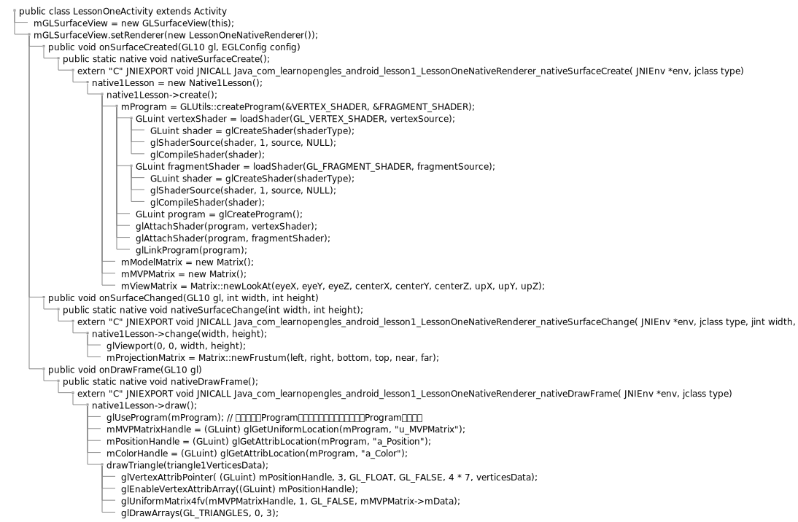

# OpenGL

## 参考文档

* [OpenGL ES SDK for Android Documentation](https://arm-software.github.io/opengl-es-sdk-for-android/index.html)
* [Learn-OpenGLES-Tutorials](https://github.com/learnopengles/Learn-OpenGLES-Tutorials)
* [Android Lesson One: Getting Started](https://www.learnopengles.com/android-lesson-one-getting-started/)
* [OpenGL--使用Shader](https://blog.csdn.net/u010223072/article/details/80641050)
* [OpenGL中文教程](https://learnopengl-cn.github.io/)

## Tutorials指令集修改内容

```
ndk{
    abiFilters "arm64-v8a"
}

externalNativeBuild {
    cmake {
        cppFlags "-frtti -fexceptions"
        arguments "-DANDROID_PLATFORM_LEVEL=${platformVersion}",
                '-DANDROID_TOOLCHAIN=clang', '-DANDROID_STL=c++_shared'
    }
}
```

## 简要介绍

```
* public class LessonOneActivity extends Activity
  * mGLSurfaceView = new GLSurfaceView(this);
  * mGLSurfaceView.setRenderer(new LessonOneNativeRenderer());
    * public void onSurfaceCreated(GL10 gl, EGLConfig config)
      * public static native void nativeSurfaceCreate();
        * extern "C" JNIEXPORT void JNICALL Java_com_learnopengles_android_lesson1_LessonOneNativeRenderer_nativeSurfaceCreate( JNIEnv *env, jclass type)
          * native1Lesson = new Native1Lesson();
            * native1Lesson->create();
              * mProgram = GLUtils::createProgram(&VERTEX_SHADER, &FRAGMENT_SHADER);
                * GLuint vertexShader = loadShader(GL_VERTEX_SHADER, vertexSource);
                  * GLuint shader = glCreateShader(shaderType);
                  * glShaderSource(shader, 1, source, NULL);
                  * glCompileShader(shader);
                * GLuint fragmentShader = loadShader(GL_FRAGMENT_SHADER, fragmentSource);
                  * GLuint shader = glCreateShader(shaderType);
                  * glShaderSource(shader, 1, source, NULL);
                  * glCompileShader(shader);
                * GLuint program = glCreateProgram();
                * glAttachShader(program, vertexShader);
                * glAttachShader(program, fragmentShader);
                * glLinkProgram(program);
              * mModelMatrix = new Matrix();
              * mMVPMatrix = new Matrix();
              * mViewMatrix = Matrix::newLookAt(eyeX, eyeY, eyeZ, centerX, centerY, centerZ, upX, upY, upZ);
    * public void onSurfaceChanged(GL10 gl, int width, int height)
      * public static native void nativeSurfaceChange(int width, int height);
        * extern "C" JNIEXPORT void JNICALL Java_com_learnopengles_android_lesson1_LessonOneNativeRenderer_nativeSurfaceChange( JNIEnv *env, jclass type, jint width, jint height)
          * native1Lesson->change(width, height);
            * glViewport(0, 0, width, height);
            * mProjectionMatrix = Matrix::newFrustum(left, right, bottom, top, near, far);
    * public void onDrawFrame(GL10 gl)
      * public static native void nativeDrawFrame();
        * extern "C" JNIEXPORT void JNICALL Java_com_learnopengles_android_lesson1_LessonOneNativeRenderer_nativeDrawFrame( JNIEnv *env, jclass type)
          * native1Lesson->draw();
            * glUseProgram(mProgram); // 激活指定的Program，接下来的绘制会使用指定的Program进行渲染
            * mMVPMatrixHandle = (GLuint) glGetUniformLocation(mProgram, "u_MVPMatrix");
            * mPositionHandle = (GLuint) glGetAttribLocation(mProgram, "a_Position");
            * mColorHandle = (GLuint) glGetAttribLocation(mProgram, "a_Color");
            * drawTriangle(triangle1VerticesData);
              * glVertexAttribPointer( (GLuint) mPositionHandle, 3, GL_FLOAT, GL_FALSE, 4 * 7, verticesData);
              * glEnableVertexAttribArray((GLuint) mPositionHandle);
              * glUniformMatrix4fv(mMVPMatrixHandle, 1, GL_FALSE, mMVPMatrix->mData);
              * glDrawArrays(GL_TRIANGLES, 0, 3);
```



## 数据适配、解析

* Shader
  ```
  const char *VERTEX_SHADER =
          "uniform mat4 u_MVPMatrix;        \n"     // A constant representing the combined model/view/projection matrix.
                  "attribute vec4 a_Position;     \n"     // Per-vertex position information we will pass in.
                  "attribute vec4 a_Color;        \n"     // Per-vertex color information we will pass in.
                  "varying vec4 v_Color;          \n"     // This will be passed into the fragment shader.
                  "void main()                    \n"     // The entry point for our vertex shader.
                  "{                              \n"
                  "   v_Color = a_Color;          \n"     // Pass the color through to the fragment shader.
                  "   gl_Position = u_MVPMatrix * a_Position; \n"     // gl_Position is a special variable used to store the final position.
                  "}                              \n";    // normalized screen coordinates.
  
  
  const char *FRAGMENT_SHADER = "precision mediump float;         \n"     // Set the default precision to medium. We don't need as high of a
          "varying vec4 v_Color;          \n"     // This is the color from the vertex shader interpolated across the
          "void main()                    \n"     // The entry point for our fragment shader.
          "{                              \n"
          "   gl_FragColor = v_Color;     \n"     // Pass the color directly through the pipeline.
          "}                              \n";
  ```
* Vertices
  ```
  // This triangle is red, green, and blue.
  GLfloat triangle1VerticesData[] = {
          // X, Y, Z,
          // R, G, B, A
          -0.5f, -0.25f, 0.0f,              // attribute vec4 a_Position;
          1.0f, 0.0f, 0.0f, 1.0f,           // attribute vec4 a_Color;
  
          0.5f, -0.25f, 0.0f,
          0.0f, 0.0f, 1.0f, 1.0f,
  
          0.0f, 0.559016994f, 0.0f,
          0.0f, 1.0f, 0.0f, 1.0f};
  ```
* Data adaptation format
  ```
  glVertexAttribPointer(
          (GLuint) mPositionHandle,
          3,                    // X, Y, Z
          GL_FLOAT,
          GL_FALSE,
          4 * 7,                // 4 byte(float size) * 7 (X, Y, Z, R, G, B, A) 
          verticesData
  );
  glEnableVertexAttribArray((GLuint) mPositionHandle);
  glVertexAttribPointer(
          (GLuint) mColorHandle,
          4,                    // R, G, B, A
          GL_FLOAT,
          GL_FALSE,
          4 * 7,                // 4 byte(float size) * 7 (X, Y, Z, R, G, B, A)
          verticesData + 3      // 3 float(X, Y, Z) offset
  );
  glEnableVertexAttribArray((GLuint) mColorHandle);
  ```